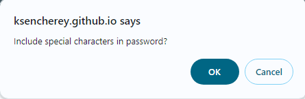

# Password-Generator App

An application that a user can use to generate a random password based on criteria they’ve selected. This app runs in the browser, and features dynamically updated HTML and CSS powered by JavaScript with a user interface that is responsive, ensuring that it adapts to multiple screen sizes.

## Description

This is an application built in `Javscript`, `HTML` and `CSS` generated a password based on user input to prompts. A generate password button is clicked to initialise the application for user inputs which are stored and then a password generated based on the stored inputs.

## How to access the application

To access the application, click on the link below
[Password Generator](https://ksencherey.github.io/password-generator/)

The application has a Display screen for the password which is generated and a Generate Password button which is used to initialise the application.

Once the application is accessed via the `URL`, click on the generate password button to initialise the generator for user inputs.

The application then prompts user to enter the length of the password between 8 and 128 characters.

Once a number is entered, hit Ok to move to the next prompts for character types to be included or excluded

Once the character types have been selected, the application then generates a random password beased on the users's answers to the prompts and displays it in the text area.

### Technologies Used

HTML - `Hyper Text Markup Language` was used to display the structure of the password generator application.

CSS - `Cascading Style Sheets` was used to style the content of the application.

JS - `JavaScript` was used to create the functions which generate the random password.

### Further Work

As knowledge in Javascript expands during the bootcamp, this application will be developed to have different pages for user inputs.
